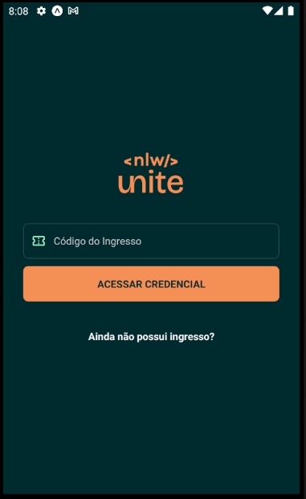

<p align="left">

  
  

  

</p>

### Tópicos

:small_blue_diamond: [Sobre o Projeto](#star-sobre-o-projeto)

:small_blue_diamond: [Objetivo](#dart-objetivo)

:small_blue_diamond: [Imagens](#sunrise_over_mountains-imagens)

:small_blue_diamond: [Funcionalidades](#bookmark_tabs-funcionalidades)

:small_blue_diamond: [Como rodar a aplicação](#arrow_forward-como-rodar-a-aplicação)

## :star: Sobre o Projeto

Aplicação desenvolvida durante o NLW Unite, evento gratuito organizado pelo Rocketseat (https://www.rocketseat.com.br/).

Este projeto foi desenvolvido utilizando:

:heavy_check_mark: Expo

:heavy_check_mark: React Native

:heavy_check_mark: Zustand para gerenciamento de estado

:heavy_check_mark: Tailwind (Native Wind)


## :dart: Objetivo

O pass.in é um aplicativo de gestão de participantes em eventos presenciais.

## :bookmark_tabs: Funcionalidades

:white_check_mark: Se inscrver em um evento
:white_check_mark: Compartilhar sua credencial via QRCode

## :sunrise_over_mountains: Imagens

<details>
<summary> Imagens da Aplicação </summary>





</details>

## :arrow_forward: Como rodar a aplicação


#### :heavy_check_mark: Clonando o Projeto

- No terminal, clone o projeto:

  ```
  https://github.com/dgo-angelo/nlw-expert-unite-app.git
  ```

### :arrow_forward: Executando a aplicação

- O back-end da aplicação, desenvolvido em Node, pode ser encontrado no repositório abaixo. Lá você encontrará o passo a passo para execução do back-end.

https://github.com/dgo-angelo/nlw-unite-pass-in-server)

- Após iniciar o bacn-end da aplicação, acessar a pasta raiz do projeto e instalar as dependencias através do comando:

```
npm install
```

- Após instalar as dependencias, executar o comando abaixo para iniciar o projeto:

```
npm start
```
<hr/>
